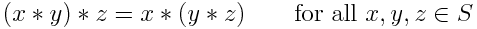
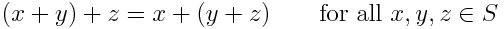

# Description: Associative Property or Associative Law

## Concepts
### Associative Property or Associative Law
* A binary operation ∗ on a set S is called associative if it satisfies the following associative law

    
* The associative property states that you can add or multiply regardless of how the numbers are grouped using 
  parenthesis. In other words, if you are adding or multiplying it does not matter where you put the parenthesis. Add 
  some parenthesis any where you like!.
* An operation that does not satisfy the above property is called non-associative.

### Associative Property of Addition
* The associative law of addition states

    

### Associative Property of Multiplication
* The associative law of multiplication of states

    

## Number Charts
* None

## Code
* Octave Code: None
* Python Code: None
* R Code: None

## TODO
* None
