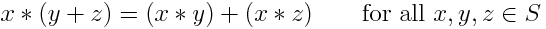
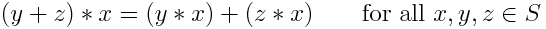
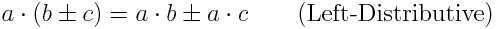
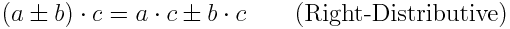
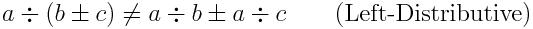
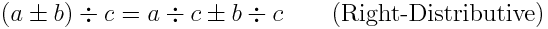

# Description: Distributive Property or Distributive Law

## Concepts
### Distributive Property or Distributive Law
* Left-Distributive: Given a set S and two binary operators ∗ and + on S, we say that the operation ∗ is 
  left-distributive over + if
  
    
* Right Distributive: Given a set S and two binary operators ∗ and + on S, we say that the operation ∗ is 
  is right-distributive over + if

    
* Distributive: The operation * is distributive over + if it is left-distributive as well as 
  right-distributive.
  
* If the operation outside the parentheses (in this case, the multiplication) is commutative, then left-distributivity 
  implies right-distributivity and vice versa.
* An operation that does not satisfy the distributive property is called non-distributive.
* The distributive property comes into play when an expression involves both addition and multiplication. A longer name 
  for it is "the distributive property of multiplication over addition". It states that if a term is multiplied by terms 
  in parenthesis, we need to "distribute" the multiplication over all the terms inside.

### Distributive Property Examples
* An example of distributive

    
    
    

* An example of right-distributive "only" is division since it is not commutative. In this case, left-distributivity does not apply

    

    
    
## TODO
* None
