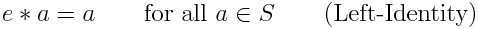
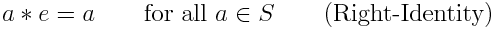
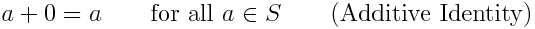
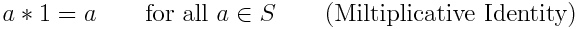

# Description: Identity Element

## Concepts
### Identity Element
Let (S, ∗) is a set S with a binary operation ∗ on it. Then 
* An element e of S is called a left identity if

    
* An element e of S is called a right identity if

    
* An element e of S is called a identity if e is both a left identity and a right identity.

### Identity Element for Addition
* The identity element for addition is 0 since 0 added to any number is the number itself. 
    
* The number 0 is called the ADDITIVE IDENTITY.

### Identity Element for Multiplication
* The identity element for multiplication is 1 since 1 multiplied to any number gives the number itself. 
    
* The number 1 is called the MULTIPLICATIVE IDENTITY.

## Number Charts
* None

## Code
* Octave Code: [Identity Element](../../code/octave/P002_Algebra_IndentityElement.m)
* Python Code: [Identity Element](../../code/python/P007_Algebra_IndentityElement.py)
* R Code: [Identity Element](../../code/r/P007_Algebra_IndentityElement.R)

## TODO
* None
