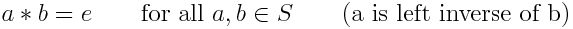
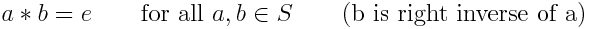

# Description: Inverse Element

## Concepts
### Inverse Element
Let (S, ∗) is a set S with a binary operation ∗ on it. Then
* An element e of S is called an left inverse of b if

    
* An element e of S is called an right inverse of a if

    
* If an element x is both a left inverse and a right inverse of y, then x is called a two-sided inverse, or simply 
  an inverse, of y. 

### Additive Inverse
* The additive inverse is defined as its inverse element under the binary operation of addition. 
* The additive inverse of a number a is the number that, when added to a, yields additive identity, 0.
* The additive inverse number is also known as the opposite, sign change, or negation.
* The additive inverse of 5 is -5 since 5 + (-5) = 0.

### Multiplicative Inverse
* The multiplicative inverse is defined as its inverse element under the binary operation of multiplication.
* The multiplicative inverse of a number a is the number that, when multiplied to a, yields multiplicative identity, 1.
* The multiplicative inverse is also known as reciprocal.
* The multiplicative inverse of 5 is 1/5 since 5 * (1/5) = 1.

## Number Charts
* None

## Code
* Octave Code: [Inverse Element](../../code/octave/P008_Algebra_InverseElement.m)
* Python Code: [Inverse Element](../../code/python/P008_Algebra_InverseElement.py)
* R Code: [Inverse Element](../../code/r/P008_Algebra_InverseElement.R)

## TODO
* None
