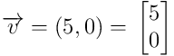
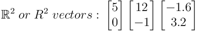
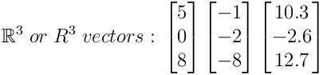
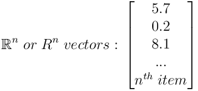
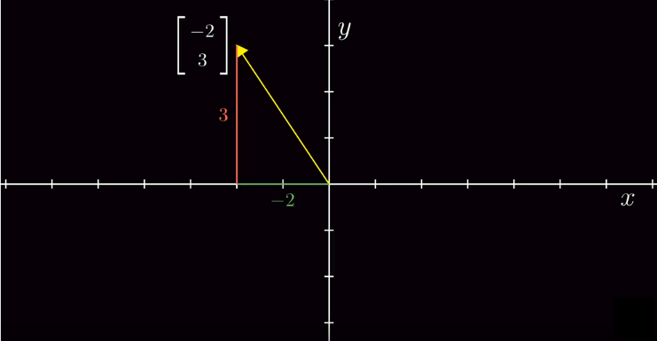
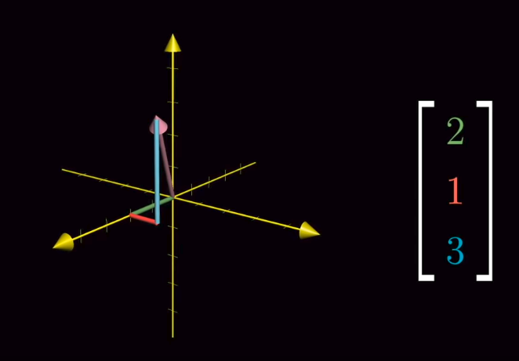
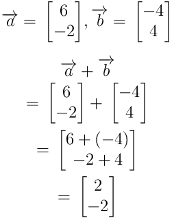
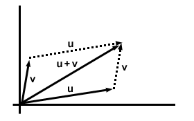
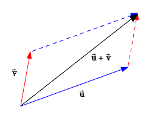
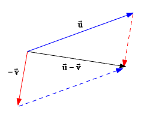

# Description: Vectors

### Scalars
1. It only has a magnitude.

### Vectors
1. It has a magnitude.
2. It has a direction.
3. It does NOT have a starting point. It can be moved around.

### Vector Notation

### Vectors in Different Dimensions

* Two-dimensional vectors: All possible real-valued ordered 2-tuples.

* Three-dimensional vectors: All possible real-valued ordered 3-tuples.

* Four-dimensional, Five-dimensional, ... N-dimensional vectors: All possible real-valued ordered n-tuples.

### Vectors Graphical Representation
* Two dimensional vectors

* Three dimensional vectors

### Vector Addition

### Vector Addition Graphically

### Vector Subtraction
Reverse the direction of the vector and add.

### Vector Multiplication with a Scalar

* Graphically
    - TODO

### Unit Vectors
* TODO

### Magnitude of a Vector
* TODO

## TODO
* None
