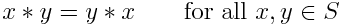

# Description: Commutative Property or Commutative Law

### Commutative Property or Commutative Law
- Common Definition: The commutative property (or commutative law) is a property generally associated with binary 
  operations and functions. If the commutative property holds for a pair of elements under a certain binary operation 
  then the two elements are said to commute under that operation. 
- Mathematical Definition: A binary operation {\displaystyle *} * on a set S is called commutative if

- An operation that does not satisfy the above property is called non-commutative.

### Commutative Property of Addition
- The commutative law of addition states
{\displaystyle y+z=z+y\qquad {\mbox{for all }}y,z\in \mathbb {R} } y+z=z+y\qquad {\mbox{for all }}y,z\in \mathbb {R} 

### Commutative Property of Multiplication
- The commutative law of multiplication of states
{\displaystyle yz=zy\qquad {\mbox{for all }}y,z\in \mathbb {R} } yz=zy\qquad {\mbox{for all }}y,z\in \mathbb {R} 

### TODO
- None
