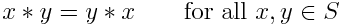
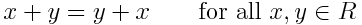
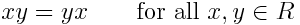

# Description: Commutative Property or Commutative Law

## Concepts
### Commutative Property or Commutative Law
- A binary operation * on a set S is called commutative if: 

- The commutative property (or commutative law) is a property generally associated with binary operations and functions.
- An operation that does not satisfy the commutative property is called non-commutative.

### Commutative Property of Addition
- The commutative law of addition states

### Commutative Property of Multiplication
- The commutative law of multiplication of states

## Number Charts
* None

## Code
* Octave Code: None
* Python Code: None
* R Code: None

## TODO
- None
